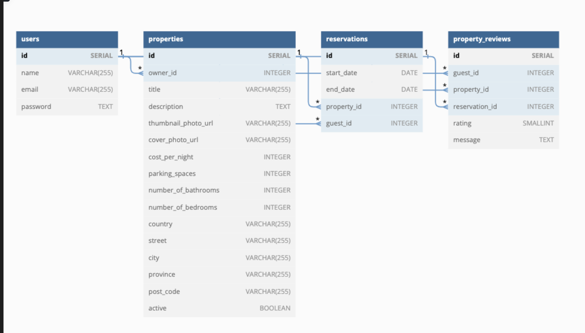

# LightBnB

Lighthouse BnB is an app that will help you manage your travel history. It will allow homeowners to rent out their homes to people on vacation, creating an alternative to hotels and bed and breakfasts. Users can view property information, book reservations, view their reservations, and write reviews.


## Purpose

The purpose of this project is to design a database and use server-side JavaScript to display the information from queries to web pages.

**_BEWARE:_ This project is for learning purposes. It is _not_ intended for use in production-grade software.**

## App Structure

```
.
├── db
│   ├── json
│   └── database.js
├── ERD
    └── ERD.png
├── public
│   ├── javascript
│   │   ├── components 
│   │   │   ├── header.js
│   │   │   ├── login_form.js
│   │   │   ├── new_property_form.js
│   │   │   ├── property_listing.js
│   │   │   ├── property_listings.js
│   │   │   ├── search_form.js
│   │   │   └── signup_form.js
│   │   ├── libraries
│   │   ├── index.js
│   │   ├── network.js
│   │   └── views_manager.js
│   ├── styles
│   │   ├── main.css
│   │   └── main.css.map
│   └── index.html
├── routes
│   ├── apiRoutes.js
│   └── userRoutes.js
├── styles  
│   ├── _forms.scss
│   ├── _header.scss
│   ├── _property-listings.scss
│   └── main.scss
├── .gitignore
├── package-lock.json
├── package.json
├── README.md
└── server.js
```

* `db` contains all the database interaction code.
  * `json` is a directory that contains a bunch of dummy data in `.json` files.
  * `database.js` is responsible for all queries to the database. It doesn't currently connect to any database, all it does is return data from `.json` files.
* `public` contains all of the HTML, CSS, and client side JavaScript.
* `ERD` contains an image of the  entity relationship diagram of the database to help users implement their own pg queries.
  * `index.html` is the entry point to the application. It's the only html page because this is a single page application.
  * `javascript` contains all of the client side javascript files.
    * `index.js` starts up the application by rendering the listings.
    * `network.js` manages all ajax requests to the server.
    * `views_manager.js` manages which components appear on screen.
    * `components` contains all of the individual html components. They are all created using jQuery.
* `routes` contains the router files which are responsible for any HTTP requests to `/users/something` or `/api/something`. 
* `styles` contains all of the sass files. 
* `server.js` is the entry point to the application. This connects the routes to the database.

## ERD



## Getting Started

1. [Create](https://docs.github.com/en/repositories/creating-and-managing-repositories/creating-a-repository-from-a-template) a new repository using this repository as a template.
2. Clone your repository onto your local device.
3. Install dependencies using the `npm install` command.
3. Start the web server using the `npm run local` command. The app will be served at <http://localhost:3000/>.
4. Go to <http://localhost:3000/> in your browser.

## Dependencies
- Express
- cookie-session
- bcrypt
- pg
- nodemon (as dev.dependency)

